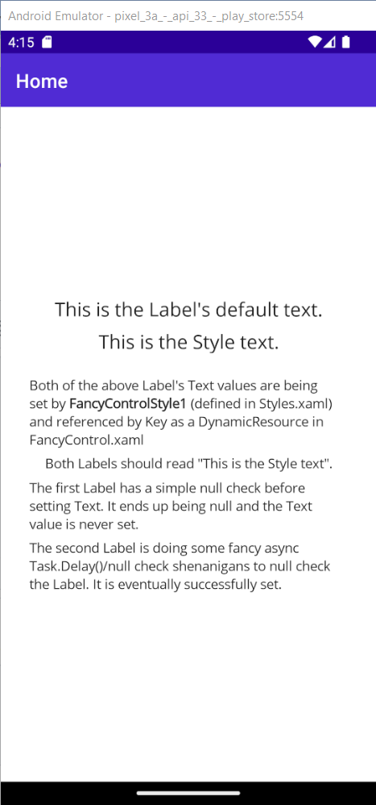
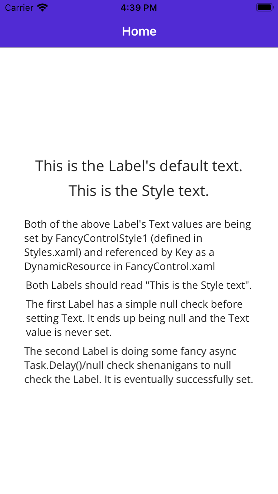

### Styles seem to be applied too early in the Page/ContentView lifecycle which can cause NullReferenceExceptions/undesired effects.

Android Screenshot:

iOS Screenshot (side note - It also looks like HTML tags don't work when setting `TextType` to `Html` in iOS because "FancyControlStyle1" should be bold):

